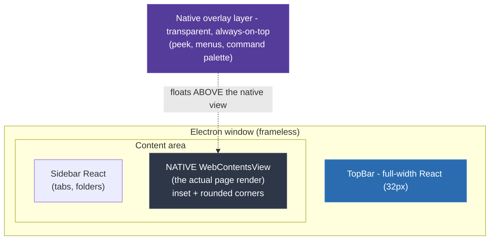
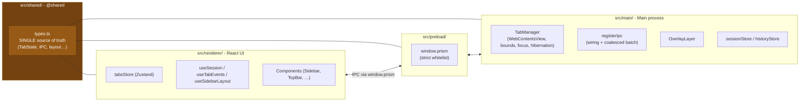
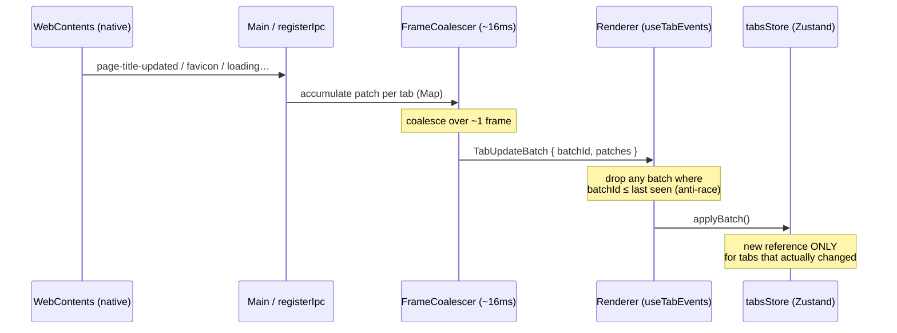
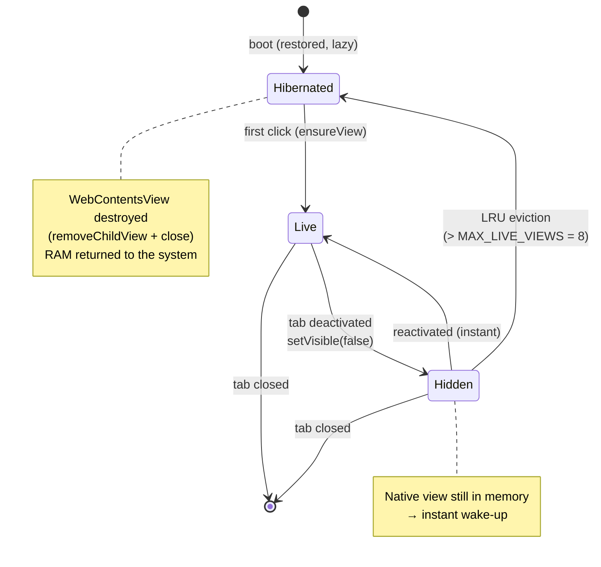
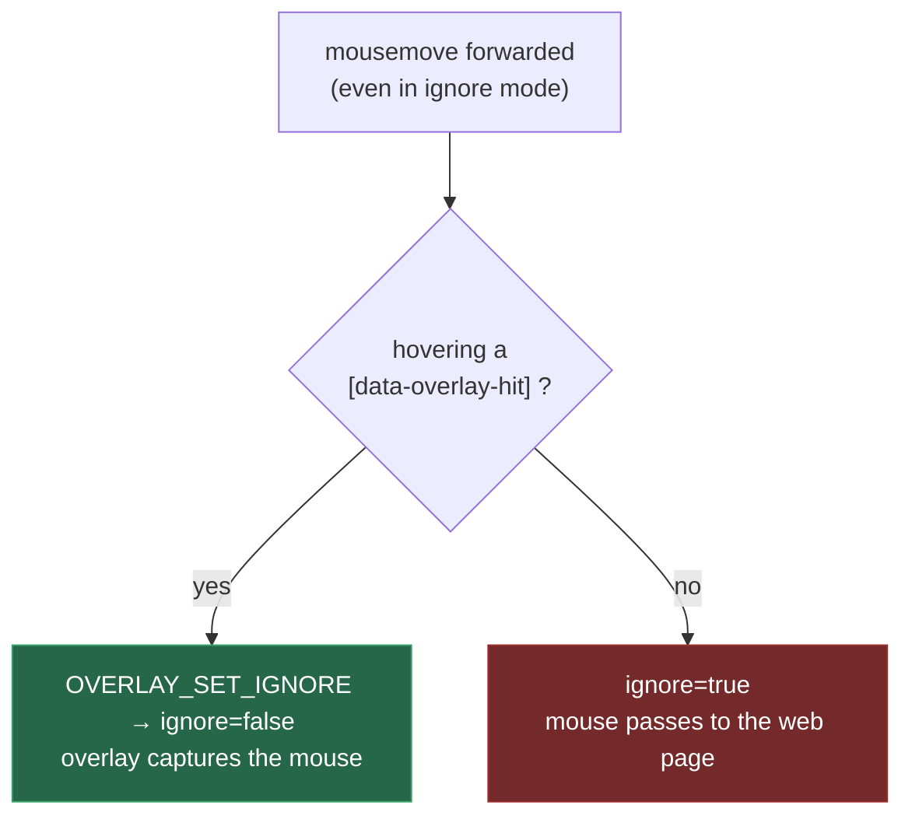

<div align="center">

# Prism

**An Arc-Inspired Desktop Web Browser for Windows**

[](https://www.electronjs.org/)
[](https://react.dev/)
[](https://www.typescriptlang.org/)
[](https://electron-vite.org/)
[](https://tailwindcss.com/)

**[:fr: Version française disponible ici](README_FRENCH.md)**

_A vertical-tab browser with spaces, split views, Arc-style tab hibernation and a native overlay layer - built around one uncommon architectural bet: painting a **native web view on top of** the React DOM._

**How it works in a nutshell**: Instead of rendering pages inside the React app, Prism paints each tab as a real native Chromium surface **on top of** the interface, and treats the React side as pure "chrome" (sidebar, top bar, menus). The Electron main process is the single source of truth for what the page looks like and where it sits; the React renderer only sends _intentions_ ("the sidebar wants to be 256px wide"). This split is what makes a rich, animated Arc-like UI coexist with a fast, native page renderer.

</div>

<div align="center">


_Prism running: vertical sidebar with spaces and pinned tabs on the left, a native web view rendered with the rounded "card" look, and the frameless custom window chrome._

</div>

---

## Abstract

> **Prism** is an MVP desktop browser that reimplements the ergonomics popularized by **Arc Browser** - vertical tabs, thematic spaces, split views, sleeping tabs and a minimal chrome - on top of the **Electron + React** stack, optimized for Windows. Its defining technical choice is that **every tab is a native `WebContentsView`** composited *above* the React DOM by the main process, rather than an `<iframe>` or `<webview>` inside the app. This inversion drives the whole architecture: the **main process owns all real state** (navigation, view bounds, focus, hibernation) while the **renderer owns only UI state** (title, favicon, loading, tab order, folders, active tab) and never emits raw pixels - only layout *intentions*. Because a native surface would paint over any React popover, all floating UI (sidebar peek, site controls, context menus, command palette) lives in **one persistent transparent overlay window** with mouse-forwarding hit-testing for click-through. Tabs follow an **Arc-style hibernation** model - hidden first for instant wake-up, then LRU-evicted past a live-view cap to return RAM to the system - and hot updates flow through a **coalesced, monotonically-versioned IPC batch** to keep the UI fluid under rapid tab switching.

### Key Features

- **Vertical tabs & resizable sidebar** -- tabs stacked vertically in a collapsible sidebar, with drag-and-drop reordering (`@dnd-kit`).
- **Spaces / folders** -- collapsible folders to group tabs by context, Arc-style.
- **Split View** -- two pages shown side by side (horizontal or vertical), created from a menu or by dropping one tab onto another; live orientation conversion and pane detach.
- **Arc-style hibernation** -- an inactive tab is first hidden (instant wake), then its native view is destroyed past `MAX_LIVE_VIEWS` via LRU eviction, freeing the renderer process.
- **Lazy boot** -- restored tabs register as hibernated; the `WebContentsView` is only (re)created on first click.
- **Sidebar peek** -- hovering the left edge slides the sidebar over the page without pushing content aside.
- **Native overlay layer** -- every popover, context menu and the command palette render *above* the native page, with CSS animations and instant opening.
- **Smart omnibox** -- distinguishes direct URL vs. bare domain (→ `https://`) vs. Google search, with Google Suggest completions.
- **Local history with frecency** -- a dedicated internal page (`prism://history/`, `Ctrl+H`) with search and per-visit deletion.
- **Pinned favorites** and a **session restored on startup** (tabs, folders, order, splits, favorites), persisted with debounced JSON writes.
- **Frameless window** with custom minimize / maximize / close controls.

---

## Table of Contents

- [The Founding Principle: A Native View Above the DOM](#the-founding-principle-a-native-view-above-the-dom)
- [The Three Spaces](#the-three-spaces)
- [Coalesced IPC Flow](#coalesced-ipc-flow)
- [Tab Lifecycle & Hibernation](#tab-lifecycle--hibernation)
- [The Single Overlay Layer](#the-single-overlay-layer)
- [Main ↔ Renderer State Partition](#main--renderer-state-partition)
- [Tech Stack](#tech-stack)
- [Project Structure](#project-structure)
- [Getting Started](#getting-started)
- [Commands](#commands)

---

## The Founding Principle: A Native View Above the DOM

Each tab's renderer is a **native `WebContentsView`**, painted by the main process **over** the React DOM. It is not a `<webview>` or an iframe - it is a real Chromium surface composited above the window. This choice conditions the entire architecture.



**Direct consequences:**

- **The main process is the *only* source of truth for layout.** The renderer emits *intentions* (`SidebarIntent = { width, collapsed }`), never raw pixels. Real bounds are computed in `TabManager.computeBounds()` and applied by the main process.
- **Any UI that must appear over the page** must live outside the area covered by the native view - hence the full-width `TopBar`, and the dedicated overlay layer for anything that truly floats over it.
- **A plain DOM popover would render *behind* the native view** - which is exactly why the overlay layer exists (below).

## The Three Spaces

The code is split into three spaces with distinct resolution aliases, around a **single shared type boundary**.



- `src/main/` -- Electron main process (lifecycle, native views, persistence).
- `src/preload/` -- secure bridge exposing a **strict whitelist** `window.prism` (no generic `invoke`/`send` primitive).
- `src/renderer/src/` -- React UI (aliases `@`, `@renderer`, `@shared`).
- `src/shared/` -- shared types + IPC constants, the **single source of truth** of the Main ↔ Renderer boundary.

## Coalesced IPC Flow

All channel names live in the `IPC` object of `src/shared/types.ts`, imported on both sides. The hot channel is `tab:updated`, emitted as a **coalesced batch** to keep up with rapid updates (title, favicon, loading, navigation) without saturating the IPC bridge.



- **Renderer → Main**: `invoke` when a response is expected (`session:get`, `tab:create`), fire-and-forget `send` otherwise.
- **Main → Renderer**: events. The `batchId` is **monotonic**; on the renderer side, any batch with an id ≤ the last received is ignored (anti-race during fast tab switches).

## Tab Lifecycle & Hibernation

Hibernation reproduces Arc's behavior: keep a session of dozens of tabs without blowing up RAM, while preserving near-instant wake for recent tabs.



Assumed **Electron 39 API** constraints (not to be "fixed"): `WebContents` exposes neither `destroy()` nor `blur()`. Destruction goes through `removeChildView()` + `webContents.close()` + releasing the reference (GC-eligible). The old view's "blur" is implicit: `focus()` on the new one + `setVisible(false)` on the old one.

## The Single Overlay Layer

A React DOM popover would render **behind** the `WebContentsView`. So all UI that must float over the page (sidebar peek, site controls, context menus, command palette) lives in **one native overlay window**: transparent, frameless, always-on-top, **persistent**, permanently aligned to the content area of the main window.

**Why a single layer** rather than one window per overlay:

- **Instant opening** -- no window creation or cold bundle start per open.
- **Smooth CSS animations** and a **single renderer process**.
- **Client coordinates aligned 1:1** with the main window (no screen conversion).

**Click-through**: the window lets the mouse pass through at rest (`setIgnoreMouseEvents(true, { forward: true })`). The renderer runs a **hit-test** on `mousemove` and only requests capture when a panel marked `[data-overlay-hit]` is hovered, then releases outside of it.



## Main ↔ Renderer State Partition

The golden rule: **never duplicate state between main and renderer.**

| Main ("browser state") | Renderer / Zustand ("UI state") |
|---|---|
| Real navigation | Title, favicon, loading |
| `WebContentsView`, bounds, focus | Tab order, folders |
| Hibernation | Active tab, sidebar width/state |
| Session / history persistence | Layout intentions |

On the renderer side, components subscribe to **atomic fields** (`tabs[id].title`…), never to the whole tab object nor to `order`. `applyBatch` creates a new reference only for tabs that actually changed - the discipline that keeps the UI fluid even with many tabs.

---

## Tech Stack

| Domain | Technology |
|---|---|
| Desktop runtime | **Electron 39** |
| Build / bundling | **electron-vite** (Vite 7), separate main / preload / renderer configs |
| UI | **React 19** + **TypeScript** |
| Styling | **Tailwind CSS v4** |
| Components | **shadcn/ui** (Radix UI) |
| State (UI) | **Zustand** |
| Drag & drop | **@dnd-kit** |
| Palette / commands | **cmdk** |
| Icons | **lucide-react** |
| Package manager | **pnpm** |

---

## Project Structure

```
src/
├── main/                    # Electron main process
│   ├── index.ts             # Frameless window, bootstrap
│   ├── tabs/TabManager.ts   # Core: native views, layout, hibernation
│   ├── ipc/registerIpc.ts   # IPC wiring + coalesced batch (FrameCoalescer)
│   ├── overlay/OverlayLayer.ts   # Persistent native overlay window
│   └── persistence/         # sessionStore + historyStore (debounced JSON)
├── preload/index.ts         # Secure bridge: window.prism whitelist
├── renderer/src/            # React UI
│   ├── components/          # Sidebar, TopBar, SidebarTabs, Split*, …
│   ├── overlay/             # PeekSidebar, CommandPalette, context menus
│   ├── store/tabsStore.ts   # Zustand store (pure UI, atomic fields)
│   └── hooks/               # useSession, useTabEvents, useSidebarLayout
└── shared/types.ts          # SINGLE source: TabState, IPC, layout geometry
```

---

## Getting Started

### Prerequisites

Node.js and [pnpm](https://pnpm.io/).

### Installation

```bash
pnpm install     # installs + electron-builder install-app-deps (postinstall)
```

### Quick Start

```bash
pnpm dev         # dev with renderer HMR + main reload
```

## Commands

```bash
pnpm dev              # dev with renderer HMR + main reload
pnpm start            # preview a build (electron-vite preview)
pnpm build            # full typecheck THEN electron-vite build
pnpm build:win        # build + package for Windows (electron-builder)
pnpm typecheck        # typecheck:node + typecheck:web (both tsconfigs)
pnpm lint             # eslint --cache .
pnpm format           # prettier --write .
```

> There is no test framework in this repository: pre-commit verification runs through `pnpm typecheck` and `pnpm lint`. The typecheck is split into two configs (`typecheck:node` for main + preload, `typecheck:web` for the renderer).

---

<div align="center">

Built with Electron, React & TypeScript - inspired by [Arc Browser](https://arc.net/).

</div>
