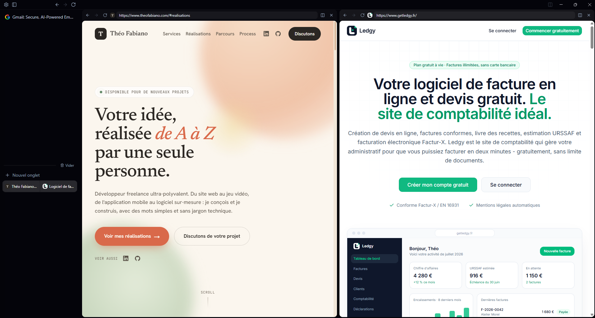
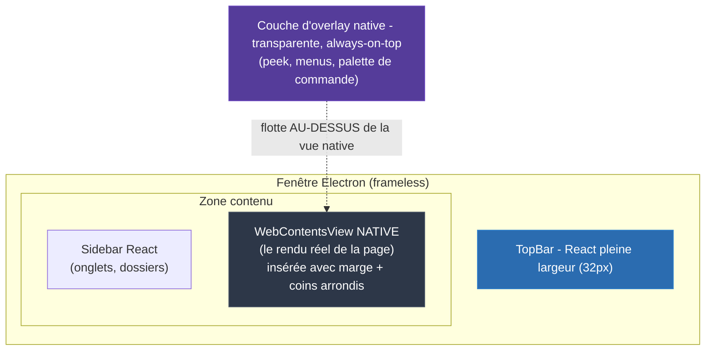
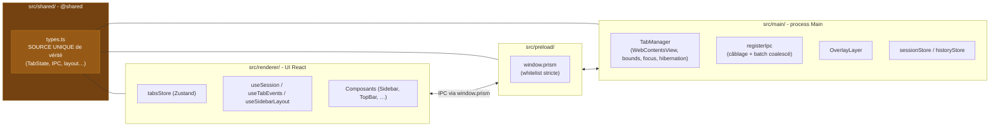
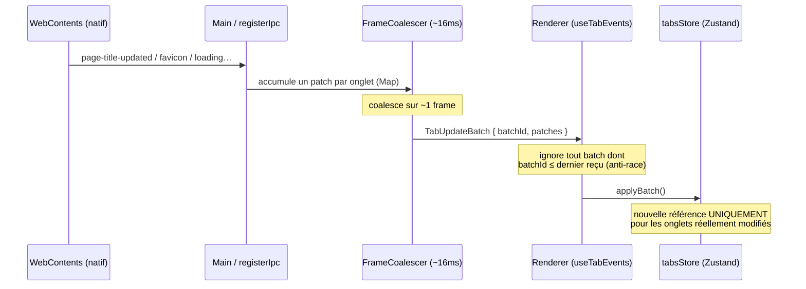
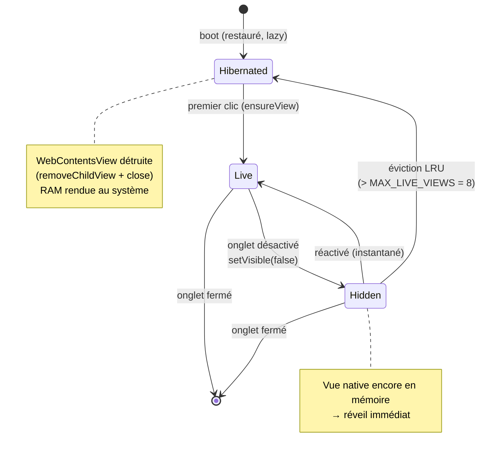
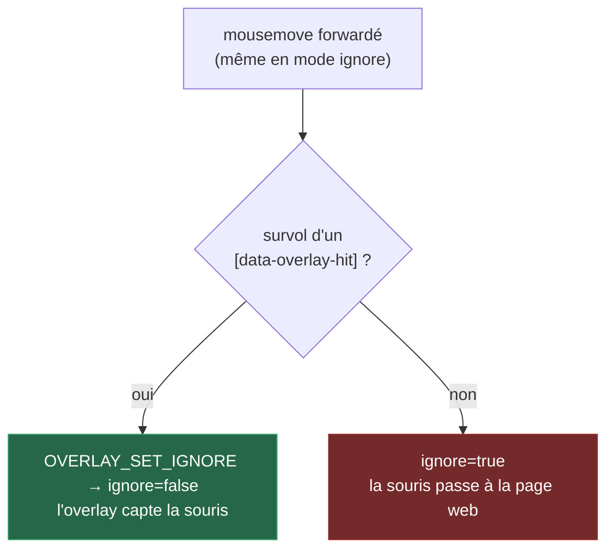

<div align="center">

# Prism

**Un navigateur web de bureau inspiré d'Arc, pour Windows**

[](https://www.electronjs.org/)
[](https://react.dev/)
[](https://www.typescriptlang.org/)
[](https://electron-vite.org/)
[](https://tailwindcss.com/)

**[:gb: English version available here](README.md)**

_Un navigateur à onglets verticaux avec espaces, vues divisées, hibernation façon Arc et couche d'overlay native - construit autour d'un parti-pris d'architecture peu commun : peindre une **vue web native par-dessus** le DOM React._

**En résumé** : au lieu de rendre les pages à l'intérieur de l'app React, Prism peint chaque onglet comme une vraie surface Chromium native **par-dessus** l'interface, et traite le côté React comme du pur « chrome » (sidebar, barre supérieure, menus). Le process Main d'Electron est la seule source de vérité de ce à quoi ressemble la page et de sa position ; le renderer React n'envoie que des _intentions_ (« la sidebar veut faire 256px de large »). C'est cette séparation qui permet à une UI riche et animée façon Arc de coexister avec un moteur de rendu de page natif et rapide.

</div>

<div align="center">



_Prism en fonctionnement : sidebar verticale avec espaces et onglets épinglés à gauche, une vue web native rendue avec le look « carte » arrondi, et le chrome de fenêtre custom sans cadre._

</div>

---

## Résumé

> **Prism** est un MVP de navigateur de bureau qui réimplémente l'ergonomie popularisée par **Arc Browser** - onglets verticaux, espaces thématiques, vues divisées, onglets qui « dorment » et chrome minimal - sur la stack **Electron + React**, optimisé pour Windows. Son choix technique fondateur est que **chaque onglet est une `WebContentsView` native** composée *au-dessus* du DOM React par le process Main, plutôt qu'un `<iframe>` ou un `<webview>` dans l'app. Cette inversion conditionne toute l'architecture : le **Main détient tout l'état réel** (navigation, bounds des vues, focus, hibernation) tandis que le **Renderer ne détient que de l'état UI** (titre, favicon, chargement, ordre des onglets, dossiers, onglet actif) et n'émet jamais de pixels bruts - seulement des *intentions* de layout. Parce qu'une surface native peindrait par-dessus n'importe quel popover React, toute l'UI flottante (peek de la sidebar, contrôles du site, menus contextuels, palette de commande) vit dans **une seule fenêtre-overlay transparente et persistante**, avec un hit-test par forwarding de la souris pour le click-through. Les onglets suivent un modèle d'**hibernation façon Arc** - masqués d'abord pour un réveil instantané, puis évincés en LRU au-delà d'un cap de vues vivantes pour rendre la RAM au système - et les mises à jour chaudes transitent par un **batch IPC coalescé et versionné de façon monotone** pour garder l'UI fluide lors des switchs d'onglets rapides.

### Fonctionnalités clés

- **Onglets verticaux & sidebar redimensionnable** -- onglets empilés verticalement dans une sidebar repliable, avec réorganisation par glisser-déposer (`@dnd-kit`).
- **Espaces / dossiers** -- dossiers rétractables pour regrouper les onglets par contexte, façon Arc.
- **Vue divisée (Split View)** -- deux pages côte à côte (horizontale ou verticale), créées via un menu ou en déposant un onglet sur un autre ; conversion d'orientation et détachement de panneau à la volée.
- **Hibernation façon Arc** -- un onglet inactif est d'abord masqué (réveil instantané), puis sa vue native est détruite au-delà de `MAX_LIVE_VIEWS` par éviction LRU, libérant le process de rendu.
- **Boot paresseux (lazy)** -- les onglets restaurés s'enregistrent hibernés ; la `WebContentsView` n'est (re)créée qu'au premier clic.
- **Peek de la sidebar** -- survoler le bord gauche fait glisser la sidebar par-dessus la page sans repousser le contenu.
- **Couche d'overlay native** -- chaque popover, menu contextuel et la palette de commande sont rendus *au-dessus* de la page native, avec animations CSS et ouverture instantanée.
- **Omnibox intelligente** -- distingue URL directe vs. domaine nu (→ `https://`) vs. recherche Google, avec suggestions Google Suggest.
- **Historique local avec frecency** -- une page interne dédiée (`prism://history/`, `Ctrl+H`) avec recherche et suppression par visite.
- **Favoris épinglés** et une **session restaurée au démarrage** (onglets, dossiers, ordre, splits, favoris), persistée par écritures JSON debouncées.
- **Fenêtre sans cadre (frameless)** avec contrôles min / max / close custom.

---

## Table des matières

- [Le principe fondateur : une vue native au-dessus du DOM](#le-principe-fondateur--une-vue-native-au-dessus-du-dom)
- [Les trois espaces](#les-trois-espaces)
- [Flux IPC coalescé](#flux-ipc-coalescé)
- [Cycle de vie d'un onglet & hibernation](#cycle-de-vie-dun-onglet--hibernation)
- [La couche d'overlay unique](#la-couche-doverlay-unique)
- [Partition des états Main ↔ Renderer](#partition-des-états-main--renderer)
- [Stack technique](#stack-technique)
- [Structure du projet](#structure-du-projet)
- [Démarrage](#démarrage)
- [Commandes](#commandes)

---

## Le principe fondateur : une vue native au-dessus du DOM

Le moteur de rendu de chaque onglet est une **`WebContentsView` native**, peinte par le process Main **par-dessus** le DOM React. Ce n'est pas un `<webview>` ni un iframe - c'est une vraie surface Chromium composée au-dessus de la fenêtre. Ce choix conditionne toute l'architecture.



**Conséquences directes :**

- **Le Main est la *seule* source de vérité du layout.** Le Renderer émet des *intentions* (`SidebarIntent = { width, collapsed }`), jamais de pixels bruts. Les bounds réels sont calculés dans `TabManager.computeBounds()` et appliqués par le Main.
- **Toute UI qui doit apparaître au-dessus de la page** doit vivre hors de la zone recouverte par la vue native - d'où la `TopBar` pleine largeur, et la couche d'overlay dédiée pour ce qui doit vraiment flotter par-dessus.
- **Un popover DOM classique se rendrait *derrière* la vue native** - ce qui est exactement la raison d'être de la couche d'overlay (ci-dessous).

## Les trois espaces

Le code est séparé en trois espaces avec des alias de résolution distincts, autour d'une **frontière unique** de types partagés.



- `src/main/` -- process Main Electron (cycle de vie, vues natives, persistance).
- `src/preload/` -- bridge sécurisé exposant une **whitelist stricte** `window.prism` (aucune primitive `invoke`/`send` générique).
- `src/renderer/src/` -- UI React (alias `@`, `@renderer`, `@shared`).
- `src/shared/` -- types + constantes IPC partagés, **source unique de vérité** de la frontière Main ↔ Renderer.

## Flux IPC coalescé

Tous les noms de canaux vivent dans l'objet `IPC` de `src/shared/types.ts`, importé des deux côtés. Le canal chaud est `tab:updated`, émis en **batch coalescé** pour tenir le rythme des mises à jour (titre, favicon, chargement, navigation) sans saturer le pont IPC.



- **Renderer → Main** : `invoke` quand une réponse est attendue (`session:get`, `tab:create`), `send` fire-and-forget sinon.
- **Main → Renderer** : events. Le `batchId` est **monotone** ; côté Renderer, tout batch dont l'id est ≤ au dernier reçu est ignoré (anti-race lors des switchs rapides d'onglets).

## Cycle de vie d'un onglet & hibernation

L'hibernation reproduit le comportement d'Arc : garder une session de dizaines d'onglets sans exploser la RAM, tout en préservant un réveil quasi instantané pour les onglets récents.



Contraintes assumées de l'**API Electron 39** (à ne pas « corriger ») : `WebContents` n'expose ni `destroy()` ni `blur()`. La destruction passe par `removeChildView()` + `webContents.close()` + libération de la référence (éligible au GC). Le « blur » de l'ancienne vue est implicite : `focus()` sur la nouvelle + `setVisible(false)` sur l'ancienne.

## La couche d'overlay unique

Un popover DOM React se rendrait **derrière** la `WebContentsView`. Toute l'UI qui doit flotter au-dessus de la page (peek de la sidebar, contrôles du site, menus contextuels, palette de commande) vit donc dans **UNE seule fenêtre-overlay native** : transparente, sans cadre, always-on-top, **persistante**, calée en permanence sur la zone contenu de la fenêtre principale.

**Pourquoi une couche unique** plutôt qu'une fenêtre par overlay :

- **Ouverture instantanée** -- aucune création de fenêtre ni démarrage à froid du bundle par ouverture.
- **Animations CSS** fluides et **un seul process renderer**.
- **Coordonnées client alignées 1:1** sur la fenêtre principale (pas de conversion écran).

**Click-through** : la fenêtre laisse passer la souris au repos (`setIgnoreMouseEvents(true, { forward: true })`). Le renderer fait un **hit-test** sur `mousemove` et ne demande la capture que lorsqu'un panneau marqué `[data-overlay-hit]` est survolé, puis rend la main en dehors.



## Partition des états Main ↔ Renderer

La règle d'or : **ne jamais dupliquer un état entre le Main et le Renderer.**

| Main (« browser state ») | Renderer / Zustand (« UI state ») |
|---|---|
| Navigation réelle | Titre, favicon, chargement |
| `WebContentsView`, bounds, focus | Ordre des onglets, dossiers |
| Hibernation | Onglet actif, largeur/état sidebar |
| Persistance session/historique | Intentions de layout |

Côté Renderer, les composants s'abonnent à des **champs atomiques** (`tabs[id].title`…), jamais à l'objet onglet entier ni à `order`. `applyBatch` ne crée une nouvelle référence que pour les onglets réellement modifiés - la discipline qui garde l'UI fluide même avec beaucoup d'onglets.

---

## Stack technique

| Domaine | Technologie |
|---|---|
| Runtime desktop | **Electron 39** |
| Build / bundling | **electron-vite** (Vite 7), configs séparées main / preload / renderer |
| UI | **React 19** + **TypeScript** |
| Styling | **Tailwind CSS v4** |
| Composants | **shadcn/ui** (Radix UI) |
| State (UI) | **Zustand** |
| Drag & drop | **@dnd-kit** |
| Palette / commandes | **cmdk** |
| Icônes | **lucide-react** |
| Gestionnaire de paquets | **pnpm** |

---

## Structure du projet

```
src/
├── main/                    # Process Main Electron
│   ├── index.ts             # Fenêtre frameless, bootstrap
│   ├── tabs/TabManager.ts   # Cœur : vues natives, layout, hibernation
│   ├── ipc/registerIpc.ts   # Câblage IPC + batch coalescé (FrameCoalescer)
│   ├── overlay/OverlayLayer.ts   # Fenêtre-overlay native persistante
│   └── persistence/         # sessionStore + historyStore (JSON debouncé)
├── preload/index.ts         # Bridge sécurisé : whitelist window.prism
├── renderer/src/            # UI React
│   ├── components/          # Sidebar, TopBar, SidebarTabs, Split*, …
│   ├── overlay/             # PeekSidebar, CommandPalette, menus contextuels
│   ├── store/tabsStore.ts   # Store Zustand (UI pur, champs atomiques)
│   └── hooks/               # useSession, useTabEvents, useSidebarLayout
└── shared/types.ts          # SOURCE UNIQUE : TabState, IPC, géométrie layout
```

---

## Démarrage

### Prérequis

Node.js et [pnpm](https://pnpm.io/).

### Installation

```bash
pnpm install     # installe + electron-builder install-app-deps (postinstall)
```

### Lancement rapide

```bash
pnpm dev         # dev avec HMR renderer + reload main
```

## Commandes

```bash
pnpm dev              # dev avec HMR renderer + reload main
pnpm start            # preview d'un build (electron-vite preview)
pnpm build            # typecheck complet PUIS electron-vite build
pnpm build:win        # build + package Windows (electron-builder)
pnpm typecheck        # typecheck:node + typecheck:web (les deux tsconfig)
pnpm lint             # eslint --cache .
pnpm format           # prettier --write .
```

> Il n'y a pas de framework de tests dans ce dépôt : la vérification pré-commit passe par `pnpm typecheck` et `pnpm lint`. Le typecheck est scindé en deux configs (`typecheck:node` pour main + preload, `typecheck:web` pour le renderer).

---

<div align="center">

Construit avec Electron, React & TypeScript - inspiré par [Arc Browser](https://arc.net/).

</div>
